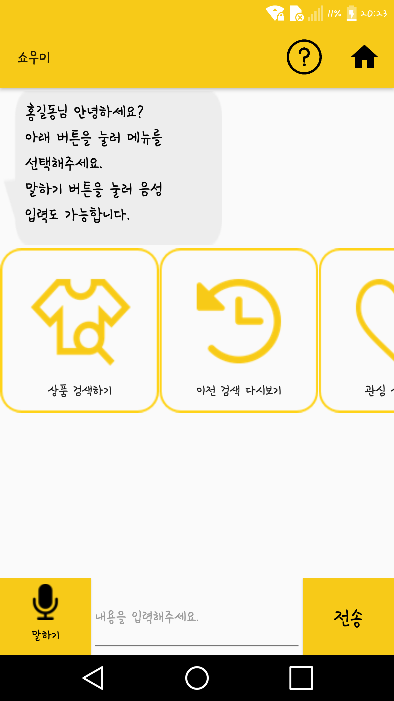
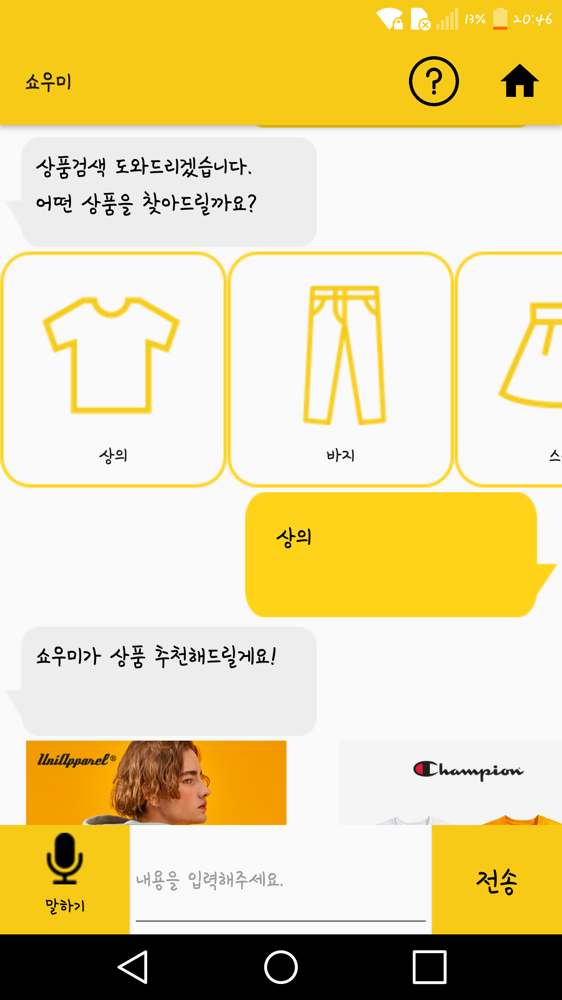
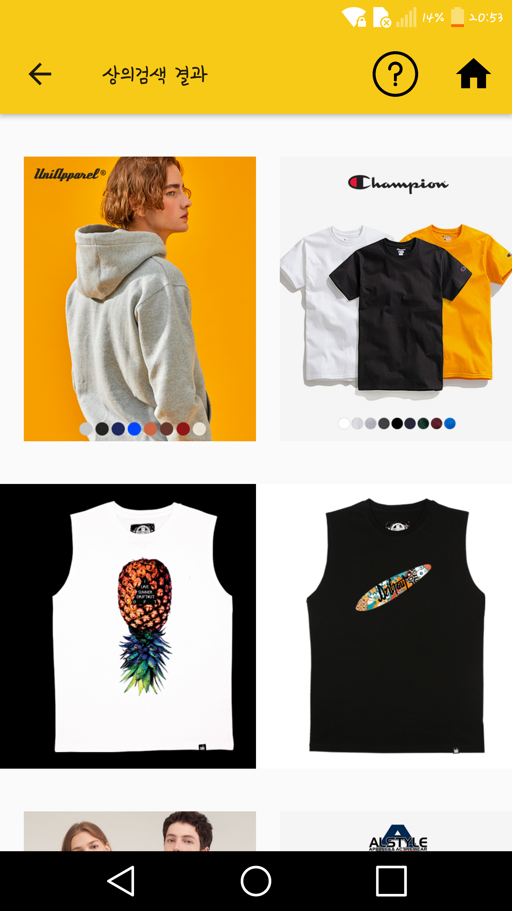
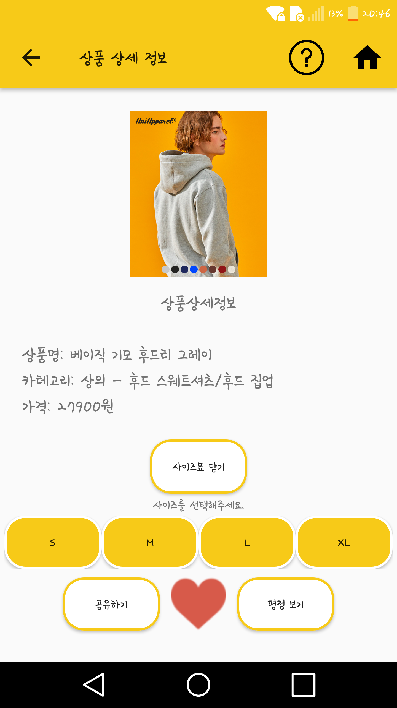
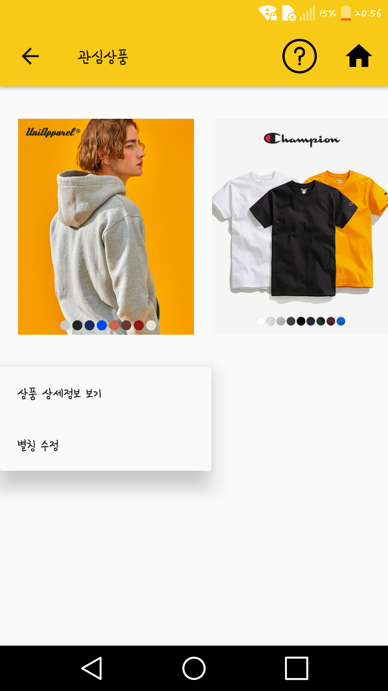

# SHOW ME (쇼우미)

**쇼우미-시각장애인 온라인 쇼핑 앱 (2019 졸업프로젝트, 배리어프리 앱 개발 콘테스트, 2019 한이음 입선, 2019 한이음 학술대회 우수상)**

멘토 : 박종한 (현대 오토에버)  
팀장 : 김채윤 (덕성여자대학교)  
팀원 : 김지선 (덕성여자대학교), 천명희 (덕성여자대학교)  

***

## 💡 목차

- [쇼우미 소개](#쇼우미-소개)
- [쇼우미 기능](#쇼우미-기능)
  - 챗봇을 통한 조작
  - 사용자 정보 등록/수정
  - 상품 검색
  - 상품 상세 정보 제공
  - 상품 리뷰 정보 제공
  - 관심 상품 등록/보기, 별칭 등록/수정
  - 관심 상품 공유 (문자, 카카오톡)
- [사용한 기술](#사용한-기술)
  - Backend
    - Google Cloude Platform / Amazon Web Service
    - MySQL
    - Spring Tool Suite 4
  - Other
    - Google DialogFlow (Chatbot)
    - Beautiful Soup / Selenium / Jsoup(Web Scraping)
    - Tensorflow / Inception V3

***

## 👕 쇼우미 소개

> 쇼우미란 쇼핑과 도우미의 합성어로 시각장애인의 온라인 쇼핑이 가능하도록 하는 안드로이드 애플리케이션을 뜻합니다. 
> 'Show Me'를 뜻하기도 하며 시각장애인에게 상품을 보여달라는 의미를 갖고 있습니다.

## 🔍 쇼우미 기능

  
  
  
  
  

- 챗봇을 통한 조작
  - 사용자에게 편리한 입력을 제공.
  - 챗봇을 이용한 대화형식의 앱 작동이 가능하도록 하여 어플 이용에 가이드라인을 제시.
- 사용자 정보 등록/수정
  - Chatbot 가이드에 맞춰 이름, 핸드폰 번호, 배송지 순서대로 사용자 정보를 등록. (핸드폰 번호와 배송지 선택사항)
  - 등록된 정보 수정 가능.
- 상품검색
  - Chatbot을 통해 사용자는 원하는 상품을 자유롭게 검색.
  - 스타일, 색상 등 추가 조건을 1가지씩 순차적으로 입력.
  - 검색 결과는 스크롤뷰를 통해 제공되며, 검색결과페이지와 챗봇에서의 미리보기로 확인 가능.
  - voice-assistant 포커스가 맞춰질 경우, 간단한 상품정보 안내.
- 상품 상세 정보 제공
  - 가격, 사이즈, 색상, 브랜드 등 상품 상세 정보를 제공.
  - 배송정보, 가이드 키워드  등 쇼핑에 도움이 되는 부가 정보를 추가로 제공.
  - 모든 상품정보를 텍스트화하여 제공함으로써 voice-assistant와 호환.
  - 해당 상품에 대한 공유, 관심 상품 등록 기능 제공.
- 상품 리뷰 정보 제공
  - 실제 구매자의 후기를 실시간 크롤링을 통해 제공.
  - 후기 외에도 평점, 키워드를 함께 제공.
- 관심 상품 등록/보기, 별칭 등록/수정
  - 관심 있는 상품을 저장해두었다가 다시 볼 수 있도록 함.
  - 관심상품 등록 시, 별칭을 붙여 쉽게 알아볼 수 있도록 함.  ex) 제주도 여행 옷, 노란색 롱 원피스, 엄마 생신 선물
  - 관심상품보기에서 상품 클릭 시, 상품 상세정보 보기/별칭 수정 두 가지 메뉴를 선택 가능.
- 관심 상품 공유(문자, 카카오톡)
  - 관심상품으로 등록된 상품의 구매링크를 문자 또는 카톡으로 공유 가능.

## 🔍 사용한 기술

💻 Backend

+ **Google Cloude Platform / Amazon Web Service**
+ **MySQL**
+ **Spring Tool Suite 4**

💻 Other

+ **Google DialogFlow (Chatbot)**

  음성 및 텍스트 기반 대화식 인터페이스를 구축하여 사용자와 상호작용

  + 구글의 챗봇 개발 플랫폼으로 자체적인 머신러닝을 통하여 학습시킬 수 있으며 자연어를 처리할 수 있음.
  + 자연어 처리(NLP)와 Intent 매칭을 통한 대화식 인터페이스.
  + <쇼움이> 전반적인 작동을 사용자가 편리하게 할 수 있도록 도와줌.
  + 인텐트에서 정의한 학습 문구와 학습 문구 내에 지정된 중요한 단어, 문구 또는 값을 사용하여 사용자 발화를 인텐트에 매칭.
  + 자연어의 사용자 질의에서 중요한 속성(엔티티)를 추출하여 실제 처리에 사용하며 다음 대화에서 다양하게 활용.
  + 인텐트를 액션으로 구분하여 각자의 알고리즘으로 기능을 구현.

+ **Web Crawling**

  상품 정보(상세가격, 상세이미지 등)를 수집하기 위해 크롤링을 이용.

  + Beautiful Soup / Selenium

    -쇼핑몰 웹사이트 구조와 상황에 맞게 BeautifulSoup과 Selenium을 적절히 사용하여 유연한 크롤러를 제작.

    -정규표현식을 이용하여 리스트에 접근하고 Json 형태로 정보를 넘겨받아 필요한 정보만을 수집하여 자체 DB에 저장.

  + Jsoup

    어플에서 실시간으로 평점 정보를 추출하여 사용자에게 제공.

+ **Tensorflow / Inception V3**

  상품 이미지의 패턴을 분석

  + Inception V3 모델을 상품에 대해 분류, 분석할 수 있도록 새로 수집한 데이테 셋으로 재학습.
  + 패턴분석을 위해 flower, check, stripes, dots, tigger 패턴 데이터셋을 수집 및 이용.
  + 정확도 90%이상의 패턴을 저장.
